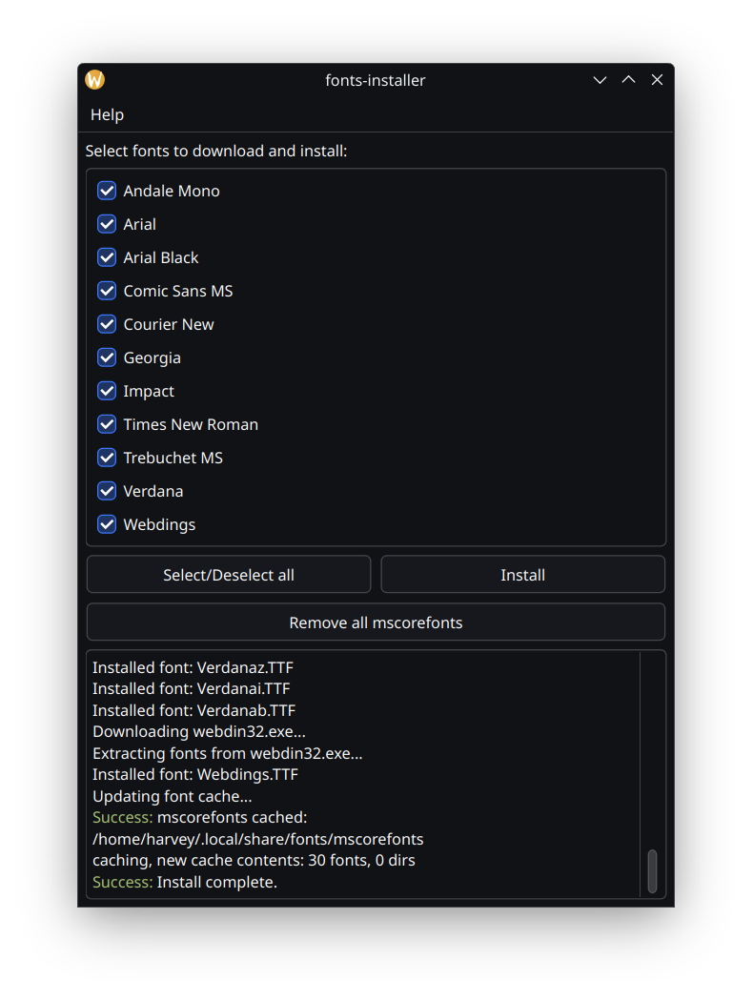

# fonts-installer

fonts-installer downloads mscorefonts from [corefonts](https://sourceforge.net/projects/corefonts/files/the%20fonts/final/), extracts them to ~/.local/share/fonts/mscorefonts/ and runs `fc-cache -fv` to refresh font cache so the fonts become immediately available.

**Please note:**
It does not track what files it installs so it only provides an option to remove the entire mscorefonts install folder and when installing it will overrite any file .ttf files with the same name already in ~/.local/share/fonts/mscorefonts.

# Icon

The icon fonts-installer.svg is taken from breeze-icons.

[Breeze icons](https://api.kde.org/frameworks/breeze-icons/html/index.html) copyright KDE and licenced under the GNU LGPL version 3 or later

#### Available fonts
- Andale Mono
- Arial (regular, bold, italic, bold italic)
- Arial Black
- Comic Sans MS (regular, bold)
- Courier New (regular, bold, italic, bold italic)
- Georgia (regular, bold, italic, bold italic)
- Impact
- Times New Roman (regular, bold, italic, bold italic)
- Trebuchet MS (regular, bold, italic, bold italic)
- Verdana (regular, bold, italic, bold italic)
- Webdings

#### Why?

mscorefonts cannot be included in Linux distribution repositories because of licensing issues. However `fonts-installer` can be, making font installation easy for novice users.

#### Dependencies
- Python 3.12+ ([case_sensitive](https://docs.python.org/3.12/whatsnew/3.12.html#pathlib) was added)
- [requests](https://pypi.org/project/requests/)
- [PySide6](https://pypi.org/project/PySide6/)
- Qt6
- p7zip (7z)
- fontconfig (fc-cache)

